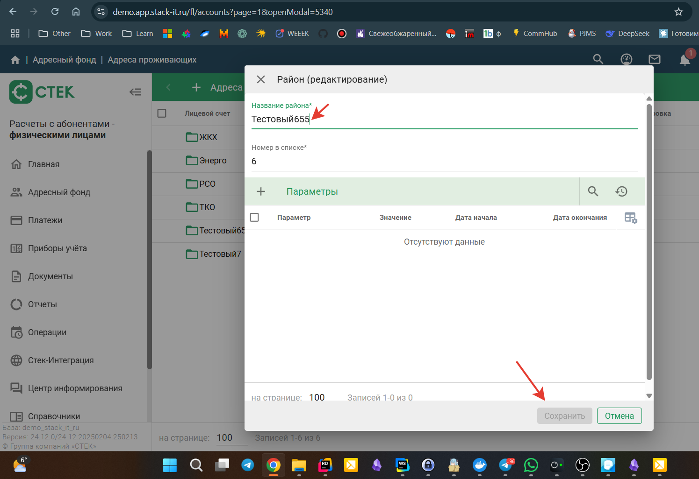
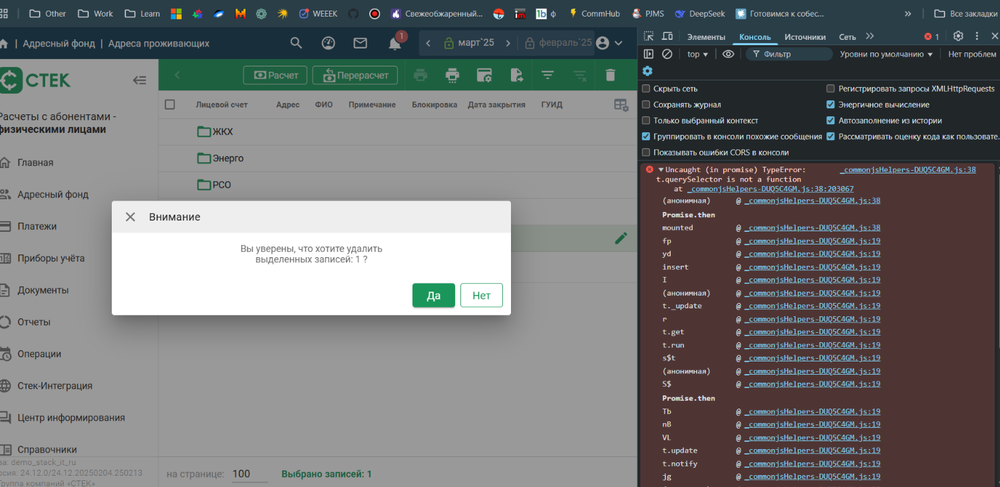
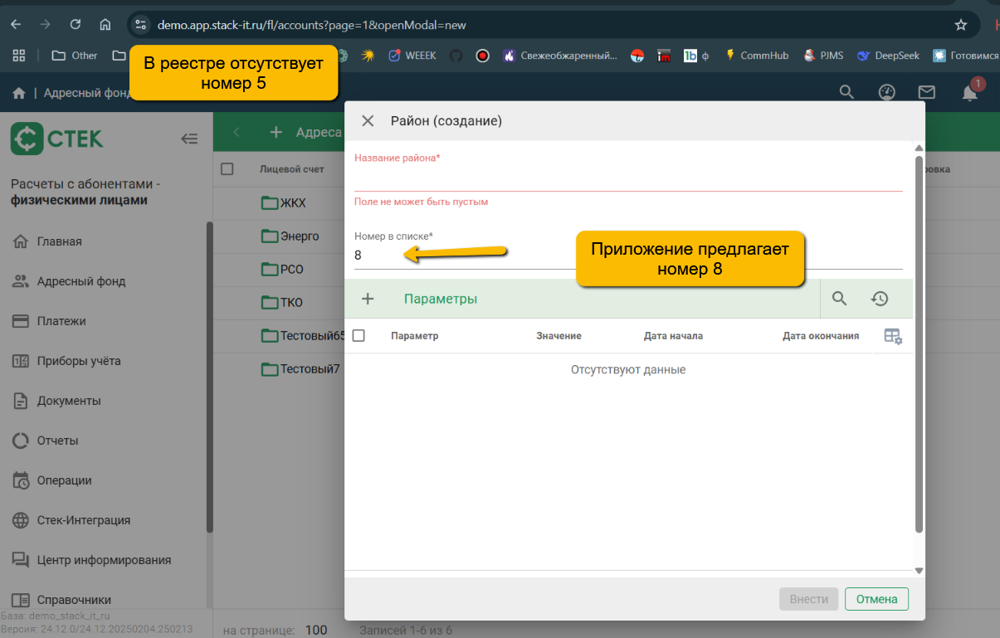
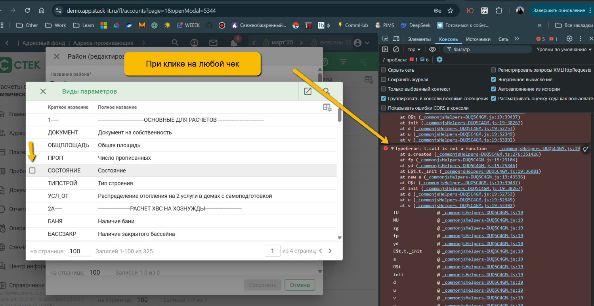
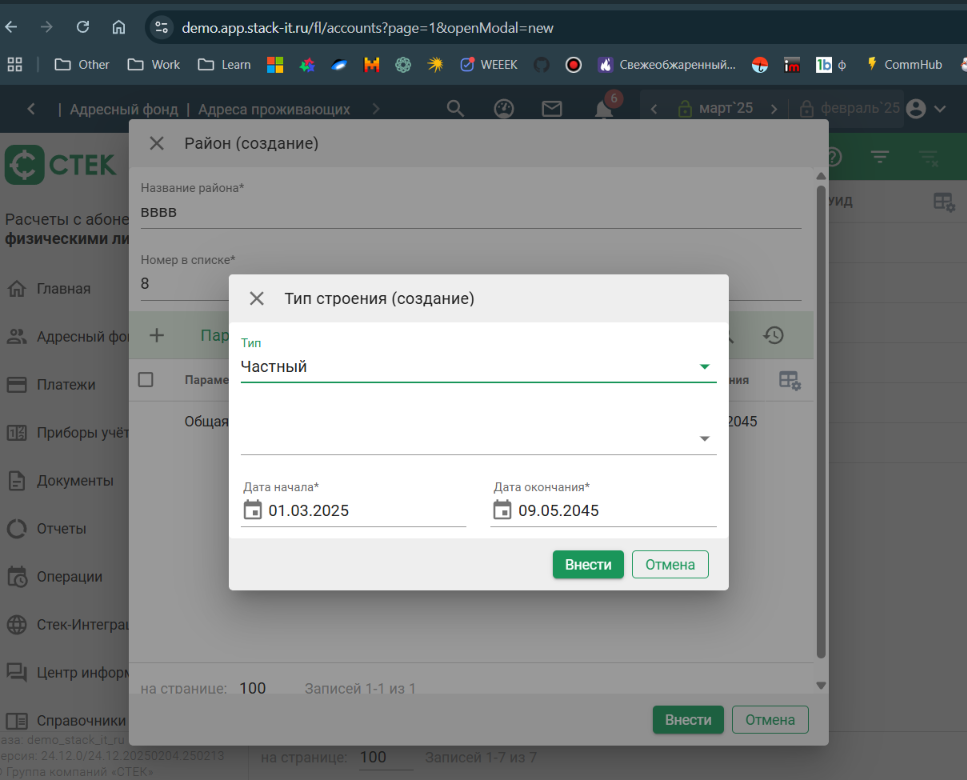
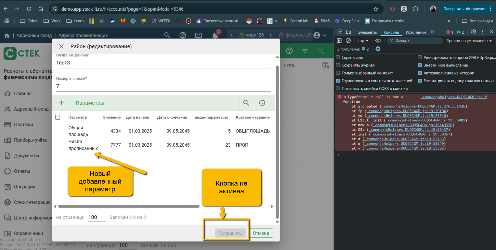

## ****bug report

#### 1. Не активна кнопка "Сохранить" в модальном окне редактирования района, если внести изменения в поля "Название района" или "Номер в списке"

###### Серьезность: Блокирующая (Запуск е2е тестов будет провален, так как кнопка не активна)
###### Шаги1:
1. Открыть любой уже существующий район на редактирование
2. Изменить значение в поле 
###### Шаги2:
1. Открыть любой уже существующий район на редактирование
2. Открыть любой из параметров
3. Изменить значение в полях параметров

###### Результат: 
при изменении значения в поле, кнопка "Сохранить" не становится активной.
###### Ожидаемый результат: 
после внесенного изменения кнопка "Сохранить" становится активной.
###### Примечание: 
Если тыкнуть прежде в любом месте модалки - становится активной
###### 

#### 2. Ошибка в консоли при попытке удаления записи из реестра адресов проживающих.

###### Серьезность: Значительная
###### Шаги 1:
1. Открыть реестр адресов проживающих
2. Открыть консоль разработчика
3. Выделить одну или несколько записей в реестре
4. Нажать на кнопку в навбаре "Удалить"

###### Шаги 2:
1. Открыть реестр адресов проживающих
2. Открыть консоль разработчика
3. Создать или открыть одну запись
4. Добавить параметры если их нет
5. Выделить несколько один или несколько параметров
6. Нажать на кнопку "Удалить"

###### Результат:
После нажатия и появления модального окна об удалении, в консоли появляется ошибка с текстом: Uncaught (in promise) TypeError: t.querySelector is not a function

###### Ожидаемый результат:
Ошибок в консоли нет

###### 

#### 3. Не соответствие порядкового номера при создании новой записи в реестре адресов проживающих
##### Примечание: Может быть оно так и задумано, необходима спецификация
###### Серьезность: Значительная
###### Шаги:
1. Открыть реестр адресов проживающих
2. Убедиться, что номера записей идут по порядку - 1,2,3,4
3. Создать запись с номером на порядок выше существующих, например, 7
4. Создать еще одну новую запись

###### Результат:
Приложение автоматически проставит номер новой записи - 8, а не 5 или 6

###### Ожидаемый результат:
Предлагается номер порядковый, отсутствующий в списке

###### 

#### 4. Название района в реестре адресов проживающих сбрасывается после редактирования

###### Серьезность: Критическая
###### Шаги:
1. Открыть реестр адресов проживающих
2. Отредактировать название района
3. Сохранить изменения, закрыть модальное окно
4. Убедиться, что название изменилось
5. Открыть район и вернуться обратно в реестр

###### Результат:
Название района сбрасывается на предыдущее, изменения не отображаются

###### Ожидаемый результат:
Отредактированное название района сохраняется и не изменяется

#### 5. Ошибка в консоли при клике на любой чек в модальном окне район (редактирование) и район (создание) выбора вида параметров

###### Серьезность: Значительная
###### Шаги1:
1. Открыть реестр адресов проживающих
2. Открыть консоль разработчика
3. Открыть уже созданную запись района или редактировать существующую
4. В модальном окне нажать на кнопку + "Параметры"
5. Кликнуть на любой чек
###### Шаги2:
1. Открыть реестр адресов проживающих
2. Открыть консоль разработчика
3. Открыть уже созданную запись района или редактировать существующую
4. В модальном окне нажать на кнопку + "Настройки таблицы параметров"
5. Выбрать пункт меню "Настройка столбцов"
###### Шаги3:
1. Открыть реестр адресов проживающих
2. Открыть консоль разработчика
3. Открыть уже созданную запись района или редактировать существующую
4. В модальном окне открыть любой уже имеющийся параметр

###### Результат:
После нажатия в консоли появляется ошибка с текстом: TypeError: t.call is not a function

###### Ожидаемый результат:
Ошибок в консоли нет

###### 

#### 6. Поле без подписи в модальном окне "Тип строения (создание)"

###### Серьезность: Значительная
###### Шаги:
1. Открыть реестр адресов проживающих
2. Открыть уже созданную запись района или редактировать существующую
3. В модальном окне нажать на кнопку + "Параметры"
4. Кликнуть на параметр "ТИПСТРОЙ"
5. Выбрать в селекте "Тип" значения "Частный" и "Прочее"

###### Результат:
После выбора типа, внизу появляется второй пустой селект без заголовка.

###### Ожидаемый результат:
У второго дополнительного поля есть заголовок (Какой должен быть смотрим в спеку) и поле предзаполненно каким-то значением

###### 

#### 7. Не сохраняются изменения в модальном окне "Район (Редактирование)" 

###### Серьезность: Блокирующая (Запуск е2е тестов будет провален, так как кнопка не активна, данные не сохранены)
###### Шаги:
1. Открыть реестр адресов проживающих
2. Открыть уже созданную запись района или редактировать существующую
3. В модальном окне нажать на кнопку + "Параметры"
4. Добавить новый параметр
5. Попробовать сохранить форму с новым параметром

###### Результат:
Параметр отобразился в списке модального окна, но кнопка "Сохранить" не активна

###### Ожидаемый результат:
Параметр отобразился в списке модального окна, кнопка "Сохранить" активна, добавленные параметры успешно сохраняются.

###### 
